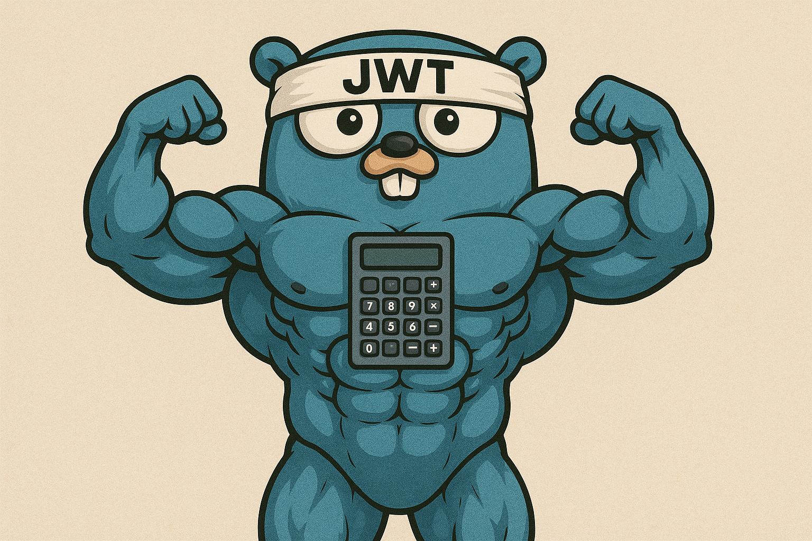
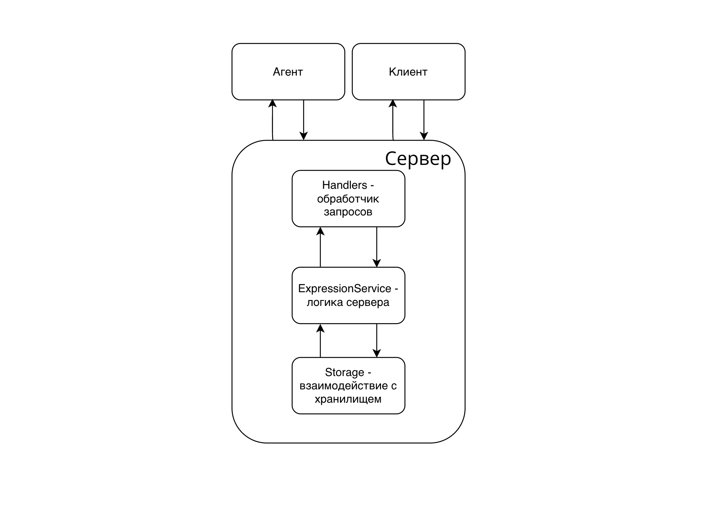

# calc_api_go
Сервис для вычисления арифметических выражений с распределенной обработкой задач.



tg: @RichCake

## Описание
Проект представляет собой систему из двух основных сервисов: **Оркестратор** и **Агент**.

**Оркестратор** выполняет следующие функции:
*   Предоставляет HTTP API для пользователей для регистрации, аутентификации и отправки арифметических выражений.
*   Принимает арифметические выражения, парсит их и разбивает на более мелкие подзадачи.
*   Управляет очередью этих подзадач.
*   Предоставляет gRPC API для агентов, чтобы они могли запрашивать подзадачи для вычисления.
*   Сохраняет выражения и их статусы (в ожидании, в процессе, вычислено, ошибка) в базе данных.

**Агент**:
*   Подключаются к Оркестратору по gRPC.
*   Запрашивают доступные подзадачи.
*   Выполняют вычисления (сложение, вычитание, умножение, деление) для полученных подзадач. Время выполнения каждой операции настраивается.
*   Отправляют результат обратно Оркестратору по gRPC.
*   Агенты могут работать параллельно, используя несколько воркеров .

Взаимодействие пользователя с системой происходит через HTTP API Оркестратора, а вычисления выполняются распределенно Агентами через gRPC.

## Инструкция по запуску
1.  Клонируйте репозиторий:
    ```bash
    git clone https://github.com/RichCake/calc_api_go.git
    cd calc_api_go
    ```
2.  (Опционально) Сконфигурируйте проект. Создайте файл `.env` в корневой директории проекта, скопировав содержимое из `.env.example`:
    ```bash
    cp .env.example .env
    ```
    Вы можете изменить следующие переменные окружения:
    *   `ORCHESTRATOR_PORT`: Порт для HTTP сервера Оркестратора (по умолчанию `8080`).
    *   `TASKS_PORT`: Порт для gRPC сервера Оркестратора, к которому подключаются Агенты (по умолчанию `50051`).
    *   `SECRET_KEY`: Секретный ключ для генерации и проверки JWT токенов аутентификации.
    *   `AUTH_TOKEN_TTL`: Время жизни JWT токена (по умолчанию `1h`).
    *   `TIME_ADDITION_MS`, `TIME_SUBTRACTION_MS`, `TIME_MULTIPLICATIONS_MS`, `TIME_DIVISIONS_MS`: Время выполнения арифметических операций в миллисекундах для Агента (по умолчанию `1s`).
    *   `AGENT_COMPUTING_POWER`: Количество параллельных воркеров у Агента для обработки задач (по умолчанию `10`).

3.  Запустите Оркестратор:
    ```bash
    go run orchestrator/cmd/main.go
    ```
4.  Запустите Агента:
    ```bash
    go run agent/cmd/main.go
    ```

## Инструкция по использованию

Взаимодействие с API Оркестратора требует аутентификации по JWT токену для большинства эндпоинтов.

1.  **Регистрация нового пользователя:**
    Отправьте POST-запрос на `/api/v1/register` с вашим логином и паролем.
    ```bash
    curl --location 'localhost:8080/api/v1/register' \
    --header 'Content-Type: application/json' \
    --data '{
      "login": "user123",
      "password": "password123"
    }'
    ```
    В случае успеха вы получите статус `201 Created`.

2.  **Получение JWT токена:**
    Отправьте POST-запрос на `/api/v1/login` с вашим логином и паролем.
    ```bash
    curl --location 'localhost:8080/api/v1/login' \
    --header 'Content-Type: application/json' \
    --data '{
      "login": "user123",
      "password": "password123"
    }'
    ```
    В ответ вы получите JWT токен:
    ```json
    {
      "token": "your_jwt_token_here"
    }
    ```
    Сохраните этот токен. Он потребуется для доступа к защищенным эндпоинтам.

3.  **Отправка выражения на вычисление:**
    Отправьте POST-запрос на `/api/v1/calculate`, передав выражение и JWT токен в заголовке `Authorization`.
    ```bash
    curl --location 'localhost:8080/api/v1/calculate' \
    --header 'Content-Type: application/json' \
    --header 'Authorization: Bearer your_jwt_token_here' \
    --data '{
      "expression": "(2+2)*3-6/2"
    }'
    ```
    В ответ вы получите ID созданного выражения:
    ```json
    {
      "id": 1
    }
    ```

4.  **Получение статуса и результата выражения:**
    Отправьте GET-запрос на `/api/v1/expressions/{id}`, где `{id}` - это ID выражения, полученный на предыдущем шаге. Не забудьте передать JWT токен.
    ```bash
    curl --location 'localhost:8080/api/v1/expressions/1' \
    --header 'Authorization: Bearer your_jwt_token_here'
    ```
    Пока выражение вычисляется, статус будет `in progress`. После успешного вычисления:
    ```json
    {
        "id": 1,
        "status": "solve",
        "result": 9
    }
    ```
    Если произошла ошибка (например, деление на ноль):
    ```json
    {
        "id": 2,
        "status": "error division by zero",
        "result": 0
    }
    ```

5.  **Получение списка всех выражений пользователя:**
    Отправьте GET-запрос на `/api/v1/expressions`.
    ```bash
    curl --location 'localhost:8080/api/v1/expressions' \
    --header 'Authorization: Bearer your_jwt_token_here'
    ```
    В ответ вы получите список всех выражений, отправленных данным пользователем:
    ```json
    [
        {
            "id": 1,
            "status": "solve",
            "result": 9
        },
        {
            "id": 2,
            "status": "error division by zero",
            "result": 0
        }
    ]
    ```

## Примеры запросов и ответов
Здесь описаны основные эндпоинты Оркестратора, их запросы и возможные ответы. Используйте curl команды из раздела "Инструкция по использованию".

*   ### POST /api/v1/register
    Регистрация нового пользователя.
    | Запрос (тело)                          | Код | Ответ (тело)                      | Описание                                  |
    | -------------------------------------- | --- | --------------------------------- | ----------------------------------------- |
    | `{"login": "newuser", "password": "p"}` | 201 | -                                 | Успешная регистрация                      |
    | `{"login": "newuser", "password": "p"}` | 409 | `{"error":"username is already taken"}` | Пользователь с таким логином уже существует |
    | `{"login": "", "password": "p"}`       | 400 | `{"error":"invalid request body"}`  | Некорректные данные (например, пустой логин) |

*   ### POST /api/v1/login
    Аутентификация пользователя и получение JWT токена.
    | Запрос (тело)                          | Код | Ответ (тело)                      | Описание                               |
    | -------------------------------------- | --- | --------------------------------- | -------------------------------------- |
    | `{"login": "user123", "password": "p"}` | 200 | `{"token":"your_jwt_token_here"}` | Успешный вход, токен выдан            |
    | `{"login": "user123", "password": "w"}` | 401 | `{"error":"invalid credentials"}`   | Неверный логин или пароль              |
    | `{"login": "", "password": "p"}`       | 400 | `{"error":"invalid request body"}`  | Некорректные данные (пустой логин)    |

*   ### POST /api/v1/calculate
    Отправка арифметического выражения на вычисление. **Требуется заголовок `Authorization: Bearer <token>`**.
    | Запрос (тело)                  | Код | Ответ (тело)                      | Описание                                                                 |
    | ------------------------------ | --- | --------------------------------- | ------------------------------------------------------------------------ |
    | `{"expression": "2+2"}`        | 200 | `{"id":1}`                        | Выражение принято, получен ID                                            |
    | `{"expression": "2+2*2)"}`     | 400 | `{"error":"mismatched bracket"}`    | Ошибка в скобочной последовательности (или `invalid expression`)          |
    | `{"expression": "2+2*a"}`      | 400 | `{"error":"invalid symbols"}`       | Некорректные символы в выражении (или `invalid expression`)              |
    | `{"expression": "2++2"}`       | 400 | `{"error":"invalid operations placement"}` | Некорректная расстановка операций (или `invalid expression`)            |
    | `{"expression": ""}`           | 400 | `{"error":"invalid expression"}`    | Пустое выражение                                                         |
    | (без тела)                     | 400 | `{"error":"invalid request body"}`  | Отсутствие тела запроса                                                  |
    | (без Authorization хедера)     | 401 | `{"error":"unauthorized"}`          | Отсутствует или невалидный JWT токен                                     |

*   ### GET /api/v1/expressions
    Получение списка всех выражений пользователя. **Требуется заголовок `Authorization: Bearer <token>`**.
    | Запрос | Код | Ответ (тело)                                                                | Описание                                      |
    | ------ | --- | --------------------------------------------------------------------------- | --------------------------------------------- |
    | -      | 200 | `[{"id": 1,"status": "solve","result": 4}, {"id": 2,"status": "pending"}]` | Список выражений (может быть пустым `[]`)    |
    | (без Authorization хедера) | 401 | `{"error":"unauthorized"}`                                                  | Отсутствует или невалидный JWT токен          |

*   ### GET /api/v1/expressions/{id}
    Получение статуса и результата конкретного выражения. **Требуется заголовок `Authorization: Bearer <token>`**.
    | Запрос (id) | Код | Ответ (тело)                                   | Описание                                      |
    | ----------- | --- | ---------------------------------------------- | --------------------------------------------- |
    | `1`         | 200 | `{"id": 1,"status": "solve","result": 4}`      | Успешное получение выражения                 |
    | `2`         | 200 | `{"id": 2,"status": "error division by zero"}` | Выражение с ошибкой                           |
    | `999`       | 404 | `{"error":"expression not found"}`             | Выражение с таким ID не найдено у пользователя |
    | `abc`       | 404 | `404 page not found`                           | Некорректный формат ID в пути                 |
    | (без Authorization хедера) | 401 | `{"error":"unauthorized"}`                                       | Отсутствует или невалидный JWT токен          |

## Структура проекта
Оркестратор и Агент имеют следующую структуру директорий:
```
calc_api_go
├── agent                   # Код Агента
│   ├── cmd/main.go         # Точка входа Агента
│   └── internal            # Внутренняя логика Агента (воркеры, gRPC клиент)
├── orchestrator            # Код Оркестратора
│   ├── cmd/main.go         # Точка входа Оркестратора
│   ├── internal            # Внутренняя логика Оркестратора
│   │   ├── application     # Инициализация и запуск приложения (HTTP, gRPC серверы)
│   │   ├── config          # Работа с конфигурацией (.env)
│   │   ├── grpc            # gRPC сервер для общения с Агентами
│   │   ├── models          # Модели данных (выражения, задачи, пользователи)
│   │   ├── services        # Бизнес-логика (парсер, управление выражениями, аутентификация)
│   │   ├── storage         # Взаимодействие с базой данных
│   │   └── transport       # Обработчики HTTP запросов и middleware
│   └── storage/store.db    # Файл базы данных SQLite (создается при первом запуске)
├── protos                  # .proto файлы для определения gRPC сервисов и сообщений
└── logs.txt                # Файл логов Оркестратора
```


Основные компоненты Оркестратора:
*   **HTTP слой (`orchestrator/internal/transport`):** Принимает запросы от пользователей, использует middleware для логирования и аутентификации, вызывает соответствующие сервисы.
*   **gRPC слой (`orchestrator/internal/grpc`):** Реализует gRPC сервер, к которому подключаются Агенты для получения задач и отправки результатов.
*   **Сервисный слой (`orchestrator/internal/services`):** Содержит основную бизнес-логику: парсинг выражений, управление задачами, аутентификация пользователей.
*   **Слой хранения (`orchestrator/internal/storage`):** Отвечает за взаимодействие с базой данных, где хранятся пользователи, выражения и задачи.

Устройство агента (`agent/internal`):
*   Устанавливает gRPC соединение с Оркестратором.
*   В цикле запрашивает задачи.
*   Распределяет полученные задачи между несколькими воркерами.
*   Воркеры выполняют вычисления и отправляют результат обратно Оркестратору.

## Тесты
Проект содержит модульные и интеграционные тесты для оркестратора.

Для запуска всех тестов выполните команду в корневой директории проекта:
```bash
go test -v ./...
```

## Логи
*   **Оркестратор:** Логи пишутся в файл `logs.txt` в корневой директории проекта. Содержат информацию о запуске сервера, обработке запросов, ошибках и статусе задач.
*   **Агент:** Логи выводятся в терминал. Содержат информацию о подключении к Оркестратору, получении и решении задач.